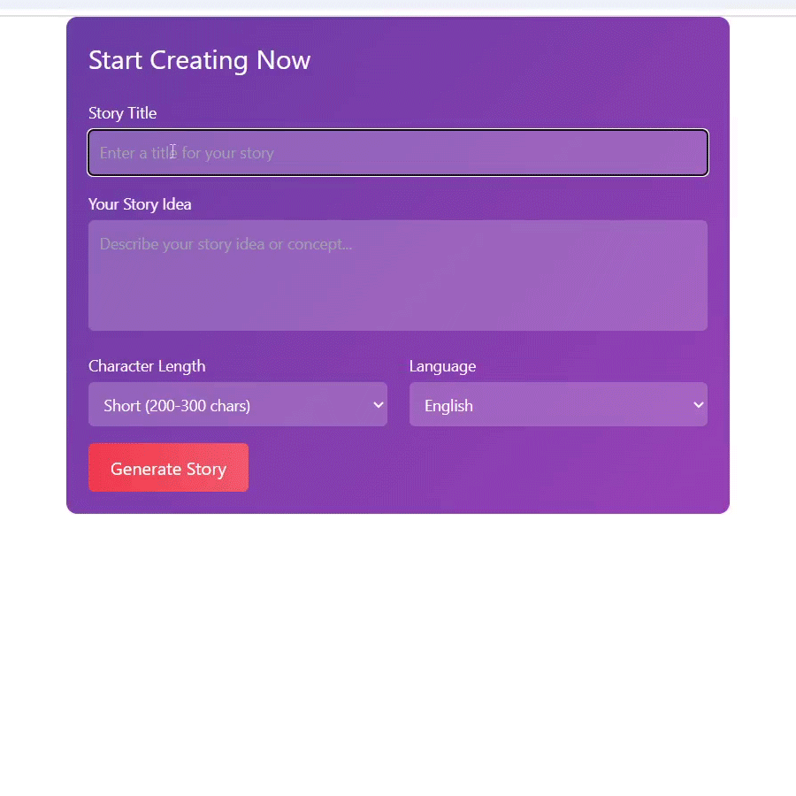

# Story Generation Application



## Overview
The **Story Generation Application** is a web-based system that allows users to generate stories using the OpenAI API (ChatGPT). The application consists of a **React frontend** and a **Spring Boot backend**. The frontend provides a user interface for inputting story details, while the backend handles the story generation process by interacting with the OpenAI API.

The system simulates a **job queue** to demonstrate how long-running tasks (e.g., a 3-minute story generation process) are handled, with periodic status updates.

## Key Features
- **User Input:** Users can input a story title, story idea, character length, and language.
- **Story Generation:** The backend uses the OpenAI API to generate a story based on user input.
- **Job Queue Simulation:** The story generation process is simulated to take 3 minutes, with status updates every 10 seconds.
- **CORS Handling:** The backend is configured to allow cross-origin requests from the React frontend.
- **API Documentation:** Swagger is integrated to document the backend APIs.

## System Architecture

### Components
1. **React Frontend:**
   - Runs on `http://localhost:3000`
   - Built using React and Axios for making HTTP requests to the backend.
   - Provides a form for users to input story details and displays the generated story.

2. **Spring Boot Backend:**
   - Runs on `http://localhost:8080`
   - Built using Spring Boot, with RESTful APIs to handle story generation and status checks.
   - Integrates with the OpenAI API to generate stories.
   - Simulates a job queue for long-running tasks.

3. **OpenAI API:**
   - External API used to generate stories based on user prompts.
   - Accessed via HTTP requests from the backend.

4. **Swagger:**
   - Provides API documentation for the backend endpoints.
   - Accessible at `http://localhost:8080/swagger-ui.html`

## Data Flow
1. The user fills out the **story generation form** on the React frontend and clicks **"Generate Story"**.
2. The frontend sends a **POST request** to the backend endpoint `/api/generate-story` with the story details.
3. The backend creates a **job with a unique jobId**, starts a **background thread** to process the story generation, and returns the `jobId` to the frontend.
4. The frontend begins **polling the backend** every 10 seconds using the `/api/story-status/{jobId}` endpoint to check the job status.
5. The backend thread simulates a **3-minute process**, updating the job status every 10 seconds (e.g., "Processing: Initializing...", "Processing: Generating story idea...").
6. During the process, the backend calls the **OpenAI API** to generate the story.
7. Once the job is complete, the backend updates the job status to **"COMPLETED"** and stores the generated story.
8. The frontend receives the **"COMPLETED"** status and displays the generated story to the user.

## Running the Application
### Prerequisites
- Node.js and npm installed (for frontend)
- Java 17+ installed (for backend)
- OpenAI API key

### Backend Setup
```sh
cd backend
mvn spring-boot:run
```

### Frontend Setup
```sh
cd frontend
npm install
npm start
```

## API Endpoints
| Method | Endpoint | Description |
|--------|-------------|-------------|
| POST | `/api/generate-story` | Initiates story generation and returns a jobId |
| GET | `/api/story-status/{jobId}` | Retrieves the status of a story generation job |
| GET | `/swagger-ui.html` | Access Swagger API documentation |

## License
This project is licensed under the MIT License - see the [LICENSE](LICENSE) file for details.